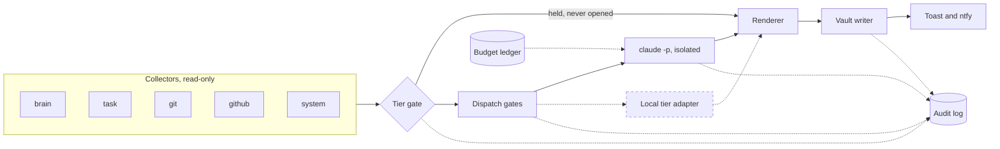

# jarvis

*A privacy-first morning digest daemon for one Windows machine; it creates a task only when you click Confirm.*

[](https://github.com/thelordofpigeons/jarvis/actions/workflows/ci.yml)
[](LICENSE)
[](https://www.python.org/)
[](tests)
[](#quick-start)

## At a glance

- **Every morning** the resident daemon `jarvisd` reads a notes vault, the active task, local git repositories, GitHub state and its own logs, and writes one digest note. The digest is observe-only. A task reaches a tracker only when you confirm a proposal, in the hub Inbox or with `jarvis proposals confirm`.
- **Safety comes from code, not from a prompt.** A deterministic tier gate decides what must stay on the machine before anything is read into a payload, and the single batched `claude -p` call runs with no tools, an isolated flag set and a daily budget cap.
- **Not built:** an operating-system sandbox around the daemon, any benchmarked local model, security tooling runs, retrieval, perception and voice. The status table says which parts were run and which were only tested against fakes.

## How a morning run works



The Task Scheduler entry `JarvisDaemon` starts one resident Python process. It ticks every 2 minutes and has a cron trigger at 06:30. Each tick reconciles whether today's digest is due and, if so, writes a job file to the queue.

1. **Collect** from the notes vault, the active task, git, GitHub and the daemon's own logs, all read-only.
2. **Gate 1, tier:** path floor, tags and terms. A hit means the item is held and the file is never opened.
3. **Router:** a stub, or the local model, classifies what is left.
4. **Gates 2 and 3:** importance, then confidence, decide where an item may go.
5. **Seal:** `clear_for_claude` produces a `GatedPayload`, the only type the Claude bridge accepts.
6. **Claude:** one batched `claude -p` call with no tools, no MCP, no settings and capped spend.
7. **Render:** a deterministic body, Claude's summary on top, held items listed by opaque id.
8. **Write:** the single vault writer creates `raw/jarvis/digest-<date>.md`.
9. **Notify:** a toast, and an optional ntfy push that carries counts only.

Every step appends to a hash-chained audit log that holds ids, counts, hashes and short error codes, never note or proposal text. The guards are `state/KILL`, pause, the daily budget ledger and a circuit breaker. The views are the `jarvis` CLI and `jarvis hub`, a loopback web page whose Inbox is its one write path. More in [architecture](docs/architecture.md).

## Quick start

```powershell
git clone https://github.com/thelordofpigeons/jarvis.git
cd jarvis
powershell -NoProfile -ExecutionPolicy Bypass -File deploy\setup-venv.ps1
copy jarvis.local.toml.example jarvis.local.toml
.\jarvis.cmd self-test
.\jarvis.cmd run-digest --dry-run
.\jarvis.cmd install-task
```

`setup-venv.ps1` looks for the per-user python.org install, then for the `py` launcher; for any other install pass `-Python <path-to-python.exe>`. `jarvis.local.toml` is gitignored and is the only place your repository list, sensitive terms and private paths belong. The daemon expects a Markdown notes folder at `~/brain`, laid out as in [vault layout](docs/vault-layout.md). With no `RECENT.md` and no session notes the digest is empty.

Read the dry-run output before the first paid run: it is the exact text that would leave the machine. Without a Claude login the digest is built deterministically. The first paid call is `.\jarvis.cmd run-digest --claude --force`, capped by `jarvis.toml`. The first-run checklist, stop and pause paths and incident runbook are in [operations](docs/v1-operations.md).

Elsewhere, `pip install -r requirements.lock` in a Python 3.12 virtualenv gives the tested set, and `pip install ".[hub]"` adds the hub. Windows only. The offline test suite never calls Claude: `.venv\Scripts\python.exe -m pytest -q`.

## Status by phase

Phases follow the build order in the [design](docs/v1-design.md). Legend: **Done** is built, tested and run for real by the author, except pieces the row names as untested. **Adapter only** is built and tested against a fake, never run against the real service or model. **Not built** has no code.

| Phase | Name | Status | What that means |
|---|---|---|---|
| 0 | Isolation | Done | Kill switch, watchdog, hostile-daemon simulation and a sandbox policy (`bin/kill-switch.ps1`, `bin/watchdog.py`, `srt-settings.json`). Ran on the author's machine; the sandbox runtime was not proven end to end without Administrator, and the v1 daemon is not under it. The kill switch also reaches the v1 daemon ([patch](docs/killswitch-v1-patch.md)), proven against a stand-in by the simulation (27 of 27 checks); a real trip against the live daemon has not been done. Record: [phase 0](docs/phase0.md) |
| 1 | Inference base | Adapter only | `jarvisd/local.py` talks to a local llama-server on loopback and is tested against a fake server. No model was downloaded, `bin/bench.ps1` was never run, so there is no throughput, latency or accuracy number. Details: [local tier](docs/local-tier.md) |
| 2 | Vertical slice | Done | The morning digest end to end: queue, scheduler, tier gate, router contract, audit, CLI, toast. Run by hand on the author's machine since 2026-10-05, with a real Claude call. The unattended 06:30 run has not been observed (see "What this is not") |
| 3 | Claude bridge | Done | The `claude -p` subprocess bridge with its budget ledger and breaker (`jarvisd/claude.py`) is used live. The Agent SDK escalation and claude-code-router are not built, by decision |
| 4 | Work hub | Adapter only | The views, Inbox, Projects, Ledger and tracker write-back are built and tested offline; a local triage model, Slack and reminders are not built. The page (`jarvisd/hub/app.py`), `jarvis ask`, `jarvis propose` and the tracker adapters never ran for real: no paid proposals run, no confirm or reject outside tests, ClickUp only met a fake server, and no one viewed the page in a browser. GitHub, the ClickUp section and ntfy are adapters tested against fakes. See [hub](docs/hub.md) and [proposals](docs/proposals.md) |
| 5 | Consolidation | Adapter only | `jarvisd/consolidate.py` proposes memory candidates from session notes. Off by default and never run against the real model. Details: [consolidation](docs/consolidation.md) |
| 6 | Security widening | Not built | No garak, promptfoo or mcp-scan run exists. Only the phase 0 kill-switch simulation is real |
| 7 | Retrieval | Not built | Native search of the notes tool is used instead |
| 8 | Perception | Not built | No code. Screenshots, OCR and browser automation are planned for rare cases only |
| 9 | Voice | Not built | Gated on a Darija speech benchmark that does not exist yet |

Next steps, in order:

1. Run a real model through the audit steps and the benchmark script, then decide on the hardware question the design leaves open.
2. Add a held-item triage job, so sensitive items are summarized locally instead of only held.
3. Run the unproven work-hub path once: a paid `jarvis propose`, then a real confirm in the Inbox with the ClickUp adapter in `dry_run` and then live, viewed in a browser. After that, try the ntfy server and the ClickUp collector.
4. Trip the elevated kill switch once against the live daemon, at the machine, and recover from it (see "How to verify" in the [patch](docs/killswitch-v1-patch.md)).

## Privacy model

- **Tier gate before any read.** `tier.safe_read_text` is the only way collectors open files. A forbidden path is refused without opening it, and a text hit withholds the item. Held items reach the digest as opaque ids, never as content.
- **Fixed gate order.** Tier, then importance, then confidence. It is code, not a prompt and not a setting, and `dispatch.decide` is a pure function tested over its whole truth table.
- **Single writer for the vault.** One module writes into the notes vault, to a short list of allowed places, and an AST test fails if any other module writes a file or names a vault write path.
- **Isolated Claude argv.** Claude is started only from `jarvisd/claude.py`, with a list argv, no shell, an empty working directory, a scrubbed environment, `--tools ""` and `--strict-mcp-config`. Only a sealed `GatedPayload` is accepted, and the final prompt is scanned once more. One optional call is an exception, see below.
- **Audit chain.** Every action appends to a hash-chained JSONL log. `jarvis audit verify` walks it, and each digest carries the chain head so a later rewrite can be noticed.

**The one exception to the isolated argv is the optional ClickUp section, which is off by default (`clickup_enabled = false`).** Its call passes neither `--tools ""` nor `--strict-mcp-config`, because the ClickUp connector is not in a config file and has to stay visible. Every other connector and MCP server of the logged-in account is then visible to the model too and is only refused: by an allowlist of two read tools, a denylist that is a snapshot of the connector's tools on 2026-10-05, and `--permission-prompts none`. A tool the connector adds later is blocked by the permission mode alone. The call carries a constant prompt and no vault text, but its reply is untrusted input. Read the injection surface in [operations](docs/v1-operations.md) before turning it on.

## CLI

`jarvis` is `jarvis.cmd` in the repository root, or `python -m jarvisd`. Exit codes: 0 ok, 1 failure, 2 usage, 3 refused by a safety control.

| Command | What it does |
|---|---|
| `jarvis serve` | the resident loop; `--task` turns Claude on, plain `serve` leaves it off |
| `jarvis run-digest` | build today's digest now; `--claude` allows the one paid call, `--dry-run` prints the payload |
| `jarvis status` | daemon heartbeat, budget, queue and last digest |
| `jarvis digest` | print the latest digest, or its path |
| `jarvis held` | resolve a held id to its source and reason, in the terminal only |
| `jarvis wrong` | record a gate mistake; `--leak` opens the breaker |
| `jarvis pause` | stop enqueue and claim for a while |
| `jarvis resume` | clear the pause |
| `jarvis audit` | `tail`, `verify` the hash chain, or `cost` per day |
| `jarvis breaker` | `status`, or `reset` with a reason |
| `jarvis local` | `status` and `check` of the local model tier; downloads nothing |
| `jarvis hub` | the web page on loopback, read-only except the Inbox; `--check` renders every view |
| `jarvis ask` | answer one question from the latest digest and notes, one capped call |
| `jarvis consolidate` | propose memory candidates from session notes (off by default) |
| `jarvis propose` `jarvis proposals` | make task proposals (off by default), list, `confirm` or `reject` them |
| `jarvis clickup` | `check` the flag set for the optional ClickUp section; `--live` makes one paid call |
| `jarvis tracker` | `check` which task tracker is ready; sends nothing |
| `jarvis self-test` | PASS, FAIL and SKIP checks; exit 1 on any FAIL |
| `jarvis install-task` | print or run the Task Scheduler registration |

## What this is not

- **Not sandboxed.** The v1 daemon runs as the human account, because the Claude login, the repositories and the toast all live there. The Phase 0 sandbox and account isolation do not constrain it. The controls are in code (the tier gate, the sealed payload, one writer, the ledger and breaker), not in an operating-system boundary.
- **Tamper-evident, not tamper-proof.** The audit chain detects edits, but a process under the same account could rewrite the log and its chain together. The chain head stored in each digest is the out-of-band check, and tail truncation is only detectable that way.
- **No local model has been benchmarked.** The local tier is an adapter exercised against a fake server. There is no measured speed or accuracy, and the privacy model for untagged personal text is heuristic, so read the dry run and keep the sensitive-terms list current.
- **Not proven unattended.** Every digest so far was started by hand or by a manual `schtasks /run`. The 06:30 scheduled path (trigger, catch-up, the wait for a fresh `RECENT.md`) is tested against a fake clock, but a scheduled run with nobody at the keyboard has not been observed. Check `jarvis status` the morning after you register the task.
- **Not 24/7.** It is resident while the machine is awake and the user is logged on. A sleep through 06:30 gives a late digest.
- **Not a finished product.** It is one person's tool, written for one person's vault layout. Expect to adapt the collectors.

## Cost

One real digest call is recorded in [first-run log](docs/first-run-log.md): 0.0068 USD for a small payload. It is one measurement, not a range; a larger payload costs more. Three limits apply before any call: a per-call cap (`max_budget_usd`, 0.50), a daily ledger (`daily_budget_usd`, 2.00, at most 6 calls) and a circuit breaker that opens after repeated failures or a rate limit and stays open until it clears or, after a privacy event, until a human resets it. The deterministic digest costs nothing.

## Docs

- [Architecture](docs/architecture.md): processes, layers, modules, gates.
- [Operator manual](docs/v1-operations.md): start, stop, pause, audit, incidents.
- [First-run log](docs/first-run-log.md): the first real run.
- [Vault layout](docs/vault-layout.md): what the notes collector reads and writes.
- [Publishing](docs/publishing.md): the rules for publishing.
- [Design](docs/v1-design.md) and [plan](docs/v1-plan.md): decisions and build order.
- [Phase 0](docs/phase0.md), [runbook](docs/phase0-runbook.md) and [sandbox policy](docs/sandbox-policy.md): isolation.
- [Kill switch v1 patch](docs/killswitch-v1-patch.md): how it reaches the v1 daemon.
- Optional parts, each with its status on top: [local tier](docs/local-tier.md), [hub](docs/hub.md), [proposals](docs/proposals.md), [consolidation](docs/consolidation.md) and [ntfy](docs/notify-ntfy.md).
- [Changelog](CHANGELOG.md), [contributing](CONTRIBUTING.md) and [citation](CITATION.cff).

## License

MIT, see [LICENSE](LICENSE).
